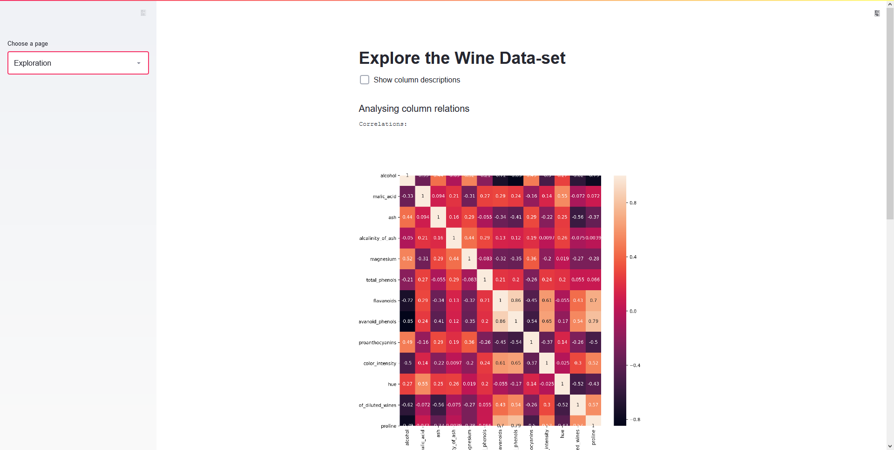

# Deploying your Streamlit dashboard with Heroku

Having created a beautiful dashboard is great but the reason for creating a dashboard is to show it to others. In order for others to be able to see your work you need to deploy your application. Heroku is a platform as a service (PaaS), which allows you to deploy your Streamlit dashboard for free.

For this guide I will deploy a simple example application which you can find in the [app.py file](app.py)



## 1. Create needed files

First, you need to add some files that allow Heroku to install the needed requirements and run the application.

### 1.1 requirements.txt

The requirements.txt file contains all the libraries that need to be installed for the project to work. This file can be created manually by going through all files and looking what libraries are used or automatically using something like pipreqs.

```bash
pipreqs <directory-path>
```

The requirements file should look something like the following:

```bash
streamlit==0.79.0
pandas==1.2.3
numpy==1.18.5
matplotlib==3.3.2
seaborn==0.11.0
scikit_learn==0.24.1
```

### 1.2 setup.sh and Procfile
Using the setup.sh and Procfile files you can tell Heroku the needed commands for starting the application.

In the setup.sh file we will create a streamlit folder with a credentials.toml and a config.toml file.

```bash
mkdir -p ~/.streamlit/

echo "\
[general]\n\
email = \"your-email@domain.com\"\n\
" > ~/.streamlit/credentials.toml

echo "\
[server]\n\
headless = true\n\
enableCORS=false\n\
port = $PORT\n\
" > ~/.streamlit/config.toml
```

The Procfile is used to first execute the setup.sh and then call streamlit run to run the application.

```bash
web: sh setup.sh && streamlit run app.py
```

For more information on how to write a Procfile check out the [official documentation](https://devcenter.heroku.com/articles/preparing-a-codebase-for-heroku-deployment).

## 2. Creating a Git repository (if you haven't yet)

Heroku allows deployment using many different technologies including Git and Docker. In this article, we will use Git because it's simple.
A Git repository can be created with ```git init```.

## 3. Create a Heroku Account

Next, you'll need to create an Heroku account [here](https://signup.heroku.com/). In general, using Heroku is free but in order to get more features like application metrics or free SSL you'll have to pay. 

You can find a detailed overview of all the different tiers on their [pricing page](https://www.heroku.com/pricing).

## 4. Installing the Heroku Command Line Interface (CLI)

Now that you have an account you will have to [download Heroku's Command Line Interface](https://devcenter.heroku.com/articles/getting-started-with-python#set-up).

## 5. Login to Heroku

After installing the CLI you can login into the CLI using your Heroku account. For this open a terminal, move into the application folder and then execute ```heroku login```. You'll be asked to press a button and after you have  done so you'll be redirected to a login screen in your default browser.

Example:
```bash
(ml) C:\Users\Gilbert\Desktop\wine_dataset>heroku login
heroku: Press any key to open up the browser to login or q to exit:
Opening browser to https://cli-auth.heroku.com/auth/browser/51ce4b4c-bd75-4fec-b67e-2ea39e00f36d
Logging in... done
Logged in as <xyz>
```

## 6. Deploy the Application

Finally, you can deploy your application to heroku by running ```heroku create``` to create an Heroku instance. Then, push the code to that instance using the following commands.

```bash
git add .
git commit -m "some message"
git push heroku master
```

When running git push heroku master you should notice that it should automatically detect that you have a Python app and it should install all packages inside the requirements.txt. After the command has finished you should see something similar to the following:

```bash
remote: -----> Launching...
remote:        Released v3
remote:        https://glacial-meadow-66539.herokuapp.com/ deployed to Heroku
remote:
remote: Verifying deploy... done.
To https://git.heroku.com/glacial-meadow-66539.git
 * [new branch]      master -> master
```

## 7. Check if the application is running

You can check if the application was deployed successfully using ```heroku ps:scale web=1```.

Finally, the application can be opened with ```heroku open```. This will open the app using your default browser.